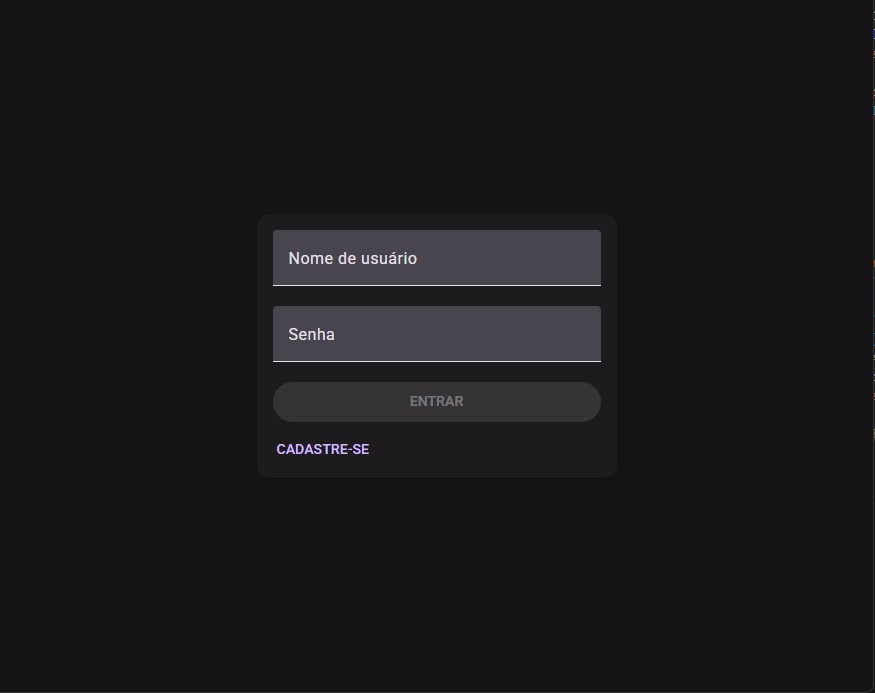
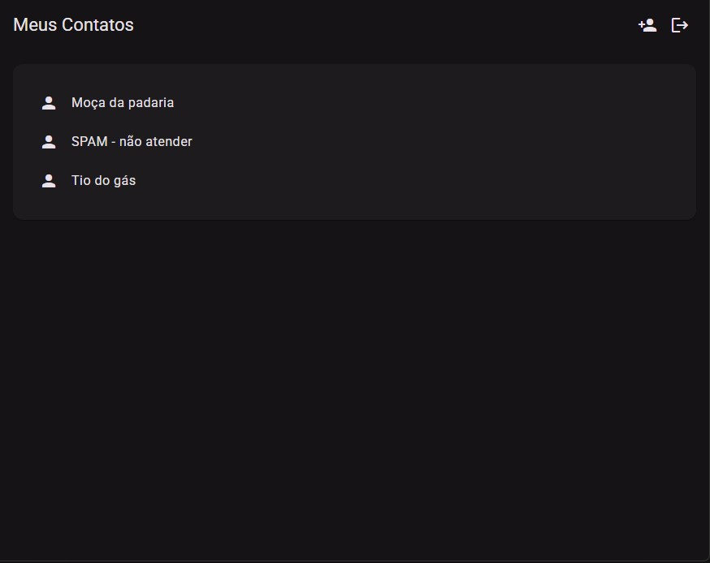
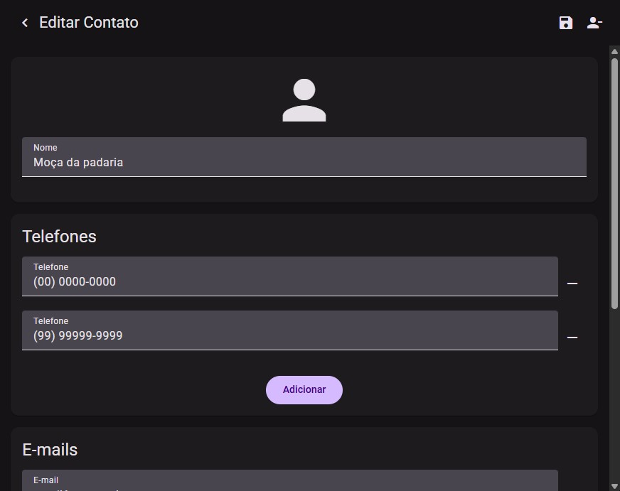
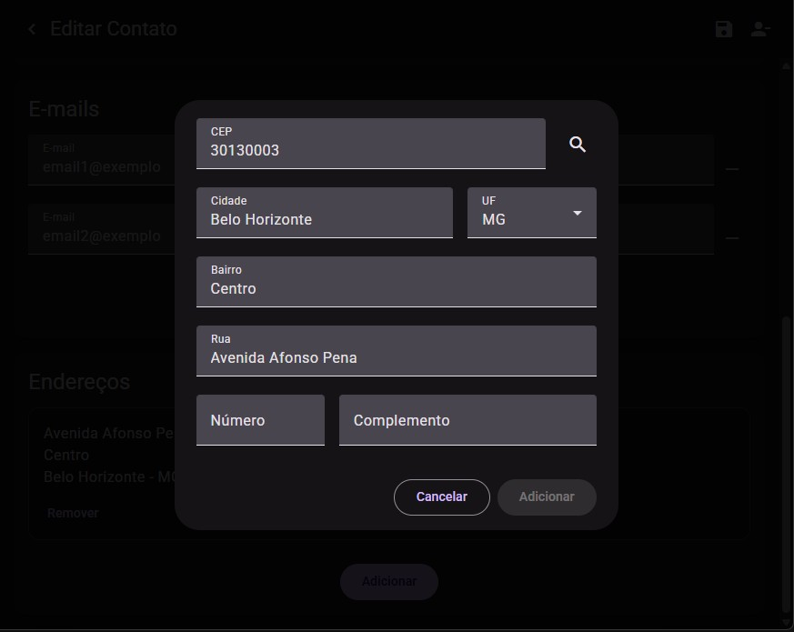
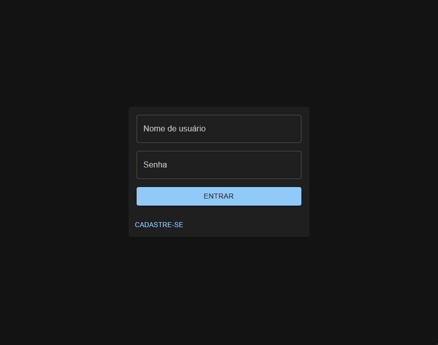
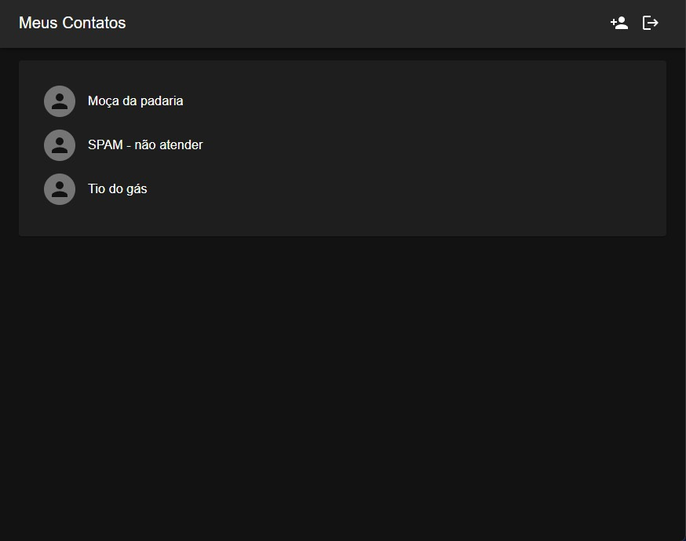
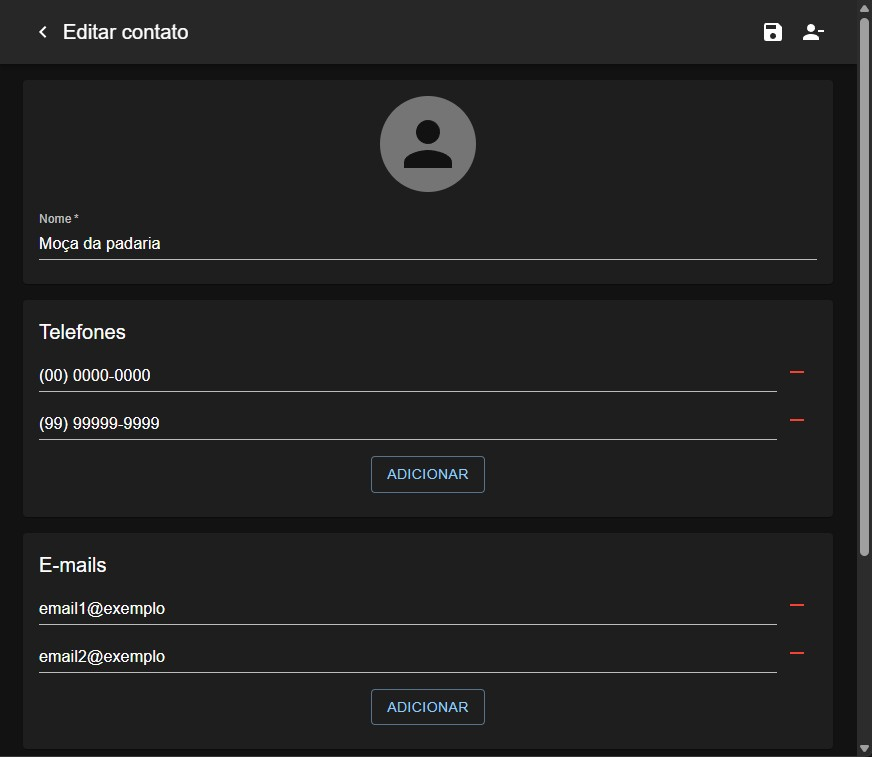
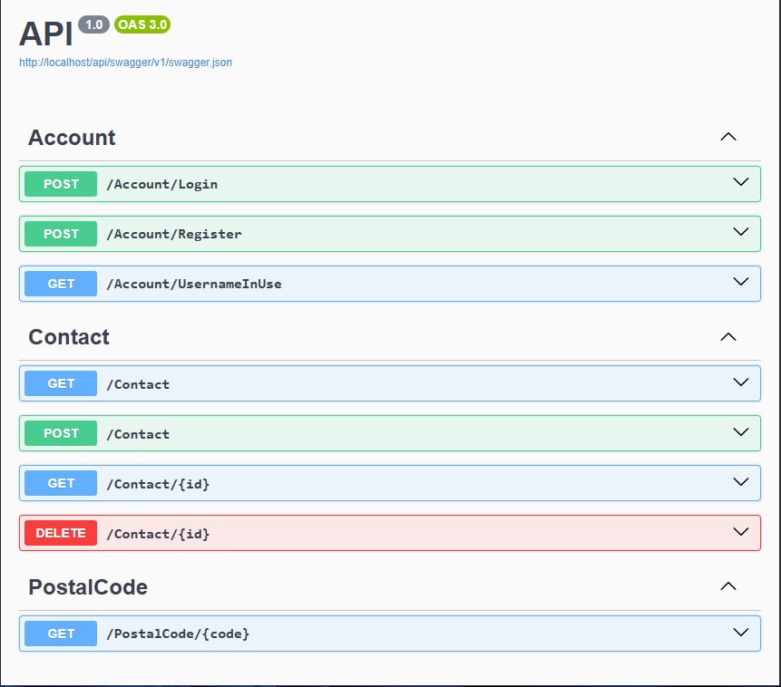

# Agenda de contatos

Projeto para fins de estudo com cadastro e autenticação de usuários, CRUD de contatos e consulta de API externa [ViaCEP](https://viacep.com.br). Ele usa as tecnologias:
1. **ASP.NET**
2. **MongoDB**
3. **React.js** com [MUI - Material UI](https://mui.com/material-ui/getting-started/)
4. **Angular 20** com [Angular Material](https://material.angular.dev)
5. **Docker**
6. **JWT**
7. **Nginx** para arquivos estáticos e redirecionamento
8. **Swagger**
9. **xUnit** para testes unitários do ASP.NET
10. **Jasmine** para testes unitários do Angular

## Execução do projeto
Para executar é necessário ter o **Docker Desktop**. Entre no diretório do projeto, execute o comando `docker compose up -d --build` e o servidor será iniciado na porta 80. Para parar, use o comando `docker compose down`.

O site é acessível nas seguintes URLs:
- `http://localhost` - redireciona para o front-end React
- `http://localhost/react` - front-end React
- `http://localhost/angular` - front-end Angular
- `http://localhost/api/swagger` - documentação Swagger

## Progresso da implementação

### Concluído
- API em ASP.NET
- Front-end Angular
- Front-end React
- Pesquisa com API externa ViaCEP

### Em andamento
- Testes unitários do ASP.NET com xUnit
- Testes unitários do Angular com Jasmine

### Planejado
- Testes unitários do React com Jest

## Imagens do projeto (Angular)
### Login

### Lista de contatos

### Cadastro de contato

### Pesquisa por CEP

## Imagens do projeto (React)
### Login

### Lista de contatos

### Cadastro de contato

### Pesquisa por CEP

## Documentação da API (Swagger)
